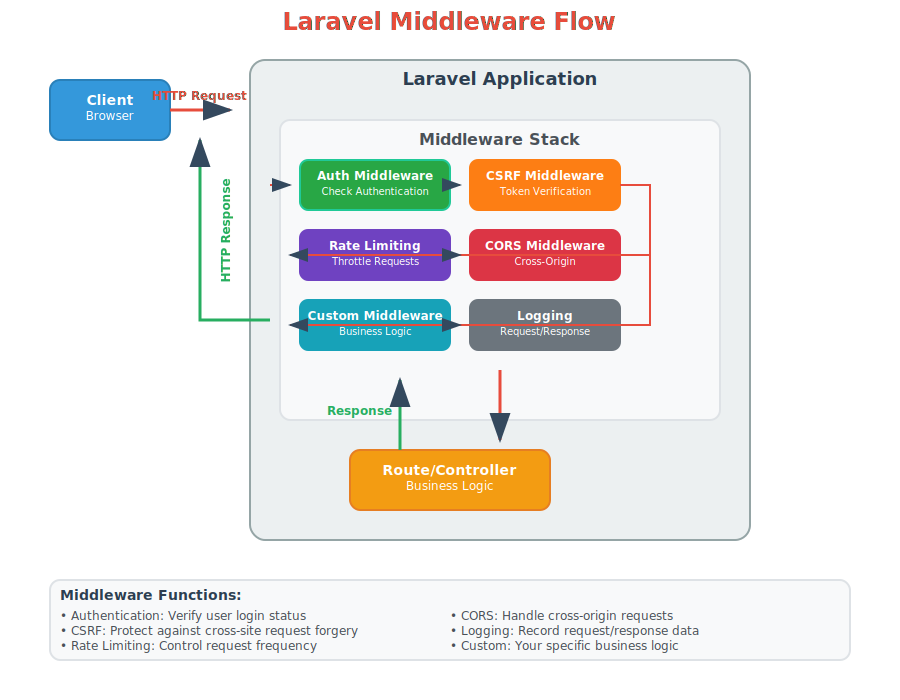

# Laravel Middleware Complete Guide

## Table of Contents
1. [Introduction](#introduction)
2. [What is Middleware?](#what-is-middleware)
3. [How Laravel Middleware Works](#how-laravel-middleware-works)
4. [Middleware Flow Diagram](#middleware-flow-diagram)
5. [Request and Response Handling](#request-and-response-handling)
6. [Common Laravel Middleware](#common-laravel-middleware)
7. [Creating Custom Middleware](#creating-custom-middleware)
8. [Middleware Registration](#middleware-registration)
9. [Best Practices](#best-practices)

## Introduction

Laravel Middleware provides a powerful mechanism for filtering HTTP requests entering your application. It acts as a bridge between a request and a response, allowing you to examine, modify, or reject requests before they reach your application's core logic.

## What is Middleware?

Laravel Middleware is a filtering mechanism that sits between HTTP requests and your application routes. It provides a convenient way to inspect, filter, and modify HTTP requests entering your application.

### Key Characteristics:
- **Filters incoming requests** before they reach controllers
- **Modifies outgoing responses** before they're sent to clients  
- **Chainable** - multiple middleware can be applied to a single route
- **Reusable** - same middleware can be used across multiple routes

## How Laravel Middleware Works

Middleware operates on a pipeline pattern where each piece of middleware is like a layer that the request must pass through. Think of it as security checkpoints at an airport - each checkpoint performs a specific validation before allowing you to proceed.

### Request Flow:
1. **Client** sends HTTP request to Laravel application
2. **Middleware Stack** processes request sequentially
3. Each middleware can:
   - Allow the request to continue
   - Modify the request
   - Terminate the request (return early response)
4. **Controller/Route** handles the request if all middleware passes
5. **Response** travels back through middleware in reverse order
6. **Client** receives the final response

## Middleware Flow Diagram



*The diagram above shows the complete middleware flow of execution in Laravel.*

## Request and Response Handling

### What Middleware Does with Requests:

#### Authentication Checks
```php
// Verify user is logged in
if (!Auth::check()) {
    return redirect('/login');
}
```

#### CSRF Protection
```php
// Validate CSRF token
if (!hash_equals($request->session()->token(), $request->input('_token'))) {
    throw new TokenMismatchException();
}
```

#### Input Validation
```php
// Validate request data
$validator = Validator::make($request->all(), $rules);
if ($validator->fails()) {
    return redirect()->back()->withErrors($validator);
}
```

#### Rate Limiting
```php
// Check request frequency
if ($this->limiter->tooManyAttempts($key, $maxAttempts)) {
    return response('Too Many Requests', 429);
}
```

### What Middleware Does with Responses:

#### Modify Response Headers
```php
// Add security headers
$response->headers->set('X-Frame-Options', 'SAMEORIGIN');
$response->headers->set('X-Content-Type-Options', 'nosniff');
```

#### Transform Response Data
```php
// Modify response content
$content = $response->getContent();
$modifiedContent = $this->transformContent($content);
$response->setContent($modifiedContent);
```

#### Add Security Headers
```php
// CORS headers
$response->headers->set('Access-Control-Allow-Origin', '*');
$response->headers->set('Access-Control-Allow-Methods', 'GET, POST, PUT, DELETE');
```

#### Log Response Information
```php
// Log response details
Log::info('Response sent', [
    'status' => $response->getStatusCode(),
    'size' => strlen($response->getContent())
]);
```

## Common Laravel Middleware

### Built-in Middleware

| Middleware | Purpose | Usage |
|------------|---------|--------|
| `auth` | Authentication check | Verify user login status |
| `csrf` | CSRF token validation | Protect against cross-site request forgery |
| `throttle` | Rate limiting | Control request frequency per user/IP |
| `cors` | Cross-origin resource sharing | Handle cross-origin requests |
| `verified` | Email verification | Ensure user has verified email |
| `signed` | Signed route validation | Validate signed URLs |
| `cache.headers` | HTTP cache headers | Set cache control headers |

### Example Usage in Routes:

```php
// Single middleware
Route::get('/dashboard', 'DashboardController@index')->middleware('auth');

// Multiple middleware
Route::get('/admin', 'AdminController@index')
    ->middleware(['auth', 'verified', 'admin']);

// Middleware with parameters
Route::get('/api/data', 'ApiController@getData')
    ->middleware('throttle:60,1');
```

## Creating Custom Middleware

### Generate Middleware:
```bash
php artisan make:middleware CheckAge
```

### Basic Middleware Structure:
```php
<?php

namespace App\Http\Middleware;

use Closure;

class CheckAge
{
    public function handle($request, Closure $next)
    {
        // Before middleware logic
        if ($request->age <= 18) {
            return redirect('home');
        }

        $response = $next($request);

        // After middleware logic
        $response->headers->set('X-Age-Verified', 'true');

        return $response;
    }
}
```

### Middleware with Parameters:
```php
public function handle($request, Closure $next, $role)
{
    if (Auth::user()->role !== $role) {
        abort(403, 'Unauthorized');
    }

    return $next($request);
}
```

## Middleware Registration

### Global Middleware
Register in `app/Http/Kernel.php`:
```php
protected $middleware = [
    \App\Http\Middleware\CheckAge::class,
];
```

### Route Middleware
```php
protected $routeMiddleware = [
    'age' => \App\Http\Middleware\CheckAge::class,
    'role' => \App\Http\Middleware\CheckRole::class,
];
```

### Middleware Groups
```php
protected $middlewareGroups = [
    'web' => [
        \App\Http\Middleware\EncryptCookies::class,
        \Illuminate\Cookie\Middleware\AddQueuedCookiesToResponse::class,
        \Illuminate\Session\Middleware\StartSession::class,
        \App\Http\Middleware\VerifyCsrfToken::class,
    ],
    
    'api' => [
        'throttle:api',
        \Illuminate\Routing\Middleware\SubstituteBindings::class,
    ],
];
```

## Best Practices

### 1. Keep Middleware Lightweight
- Perform only necessary checks
- Avoid heavy database queries
- Use caching when appropriate

### 2. Handle Errors Gracefully
```php
public function handle($request, Closure $next)
{
    try {
        // Middleware logic
        if (!$this->isValid($request)) {
            return response()->json(['error' => 'Invalid request'], 400);
        }
    } catch (Exception $e) {
        Log::error('Middleware error: ' . $e->getMessage());
        return response()->json(['error' => 'Server error'], 500);
    }

    return $next($request);
}
```

### 3. Use Appropriate Return Types
- **Redirects** for web routes
- **JSON responses** for API routes
- **Proper HTTP status codes**

### 4. Order Matters
```php
// Correct order
Route::middleware(['cors', 'auth', 'throttle:api'])
    ->group(function () {
        // API routes
    });
```

### 5. Document Your Middleware
- Clear parameter documentation
- Usage examples
- Expected behavior explanation

### 6. Test Your Middleware
```php
public function test_middleware_blocks_unauthorized_users()
{
    $response = $this->get('/admin');
    $response->assertRedirect('/login');
}

public function test_middleware_allows_authorized_users()
{
    $user = User::factory()->create(['role' => 'admin']);
    $response = $this->actingAs($user)->get('/admin');
    $response->assertStatus(200);
}
```

## Conclusion

Laravel Middleware is a powerful tool for:
- **Filtering requests** before they reach your application logic
- **Modifying responses** before they're sent to clients
- **Implementing cross-cutting concerns** like authentication, logging, and security
- **Keeping your controllers clean** by moving common logic to reusable middleware

By understanding how middleware works and following best practices, you can build more secure, maintainable, and efficient Laravel applications.

---

**Key Takeaways:**
- Middleware operates in a pipeline pattern
- Each middleware can inspect and modify requests/responses
- Order of middleware execution matters
- Keep middleware focused and lightweight
- Use appropriate middleware for different route groups
- Always handle errors gracefully in middleware