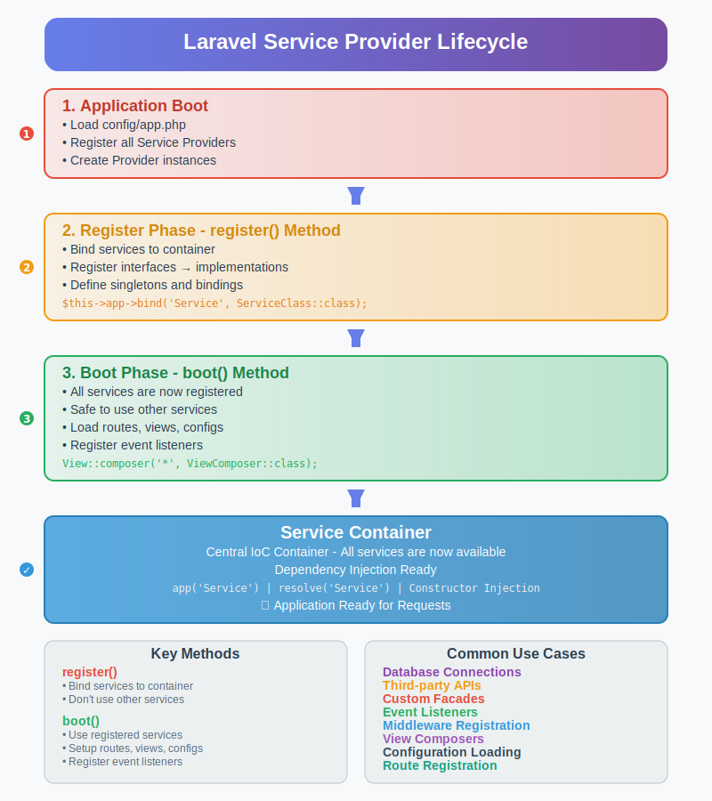

# Laravel Service Provider Complete Guide

## What is a Service Provider?

A **Service Provider** in Laravel is the central place where application bootstrapping occurs. It's a class that tells Laravel how to bind various components into the service container and configure your application. Think of Service Providers as the "bootstrapping" mechanism for your Laravel application.

Service Providers are the connection point between your package/service and Laravel's service container. They handle:
- **Service Registration** - Binding services into the IoC container
- **Configuration** - Setting up application configurations
- **Bootstrapping** - Initializing services after registration

## Core Concepts

### 1. Service Container (IoC Container)
The Service Container is Laravel's powerful dependency injection container. It manages class dependencies and performs dependency injection throughout your application.

### 2. Two Main Phases
- **Register Phase**: Services are bound to the container but not resolved
- **Boot Phase**: Services are bootstrapped and can safely use other registered services

## How Service Providers Work - Visual Flow



*The diagram above shows the complete lifecycle of Service Provider execution in Laravel.*

## Service Provider Lifecycle

### Phase 1: Application Boot
```php
// config/app.php
'providers' => [
    App\Providers\AppServiceProvider::class,
    App\Providers\AuthServiceProvider::class,
    App\Providers\CustomServiceProvider::class,
]
```
- Laravel loads all service providers listed in `config/app.php`
- Creates instances of each service provider
- Prepares for the registration phase

### Phase 2: Register Phase
```php
public function register()
{
    // Bind services to the container
    $this->app->bind(PaymentInterface::class, StripePayment::class);
    
    // Register singletons
    $this->app->singleton('custom.service', function ($app) {
        return new CustomService($app['config']['custom']);
    });
    
    // Bind concrete classes
    $this->app->bind('mailer', function ($app) {
        return new MailService($app['config']['mail']);
    });
}
```
**Key Rules for Register Method:**
- Only bind services to the container
- Don't use other services (they might not be registered yet)
- Called on ALL providers before boot phase starts

### Phase 3: Boot Phase
```php
public function boot()
{
    // Now safe to use other services
    $this->loadRoutesFrom(__DIR__.'/routes/web.php');
    $this->loadViewsFrom(__DIR__.'/resources/views', 'custom');
    
    // Register event listeners
    Event::listen('user.registered', UserRegisteredListener::class);
    
    // View composers
    View::composer('header', function ($view) {
        $view->with('user', Auth::user());
    });
    
    // Middleware registration
    $this->app['router']->aliasMiddleware('custom', CustomMiddleware::class);
}
```
**Boot Method Capabilities:**
- Use any registered service safely
- Load routes, views, configurations
- Register event listeners and middleware
- Set up view composers
- Publish assets and configurations

### Phase 4: Application Ready
After both phases complete:
- All services are available via dependency injection
- Service container is fully populated
- Application is ready to handle requests

## Creating a Custom Service Provider

### Step 1: Generate Provider
```bash
php artisan make:provider PaymentServiceProvider
```

### Step 2: Implement the Provider
```php
<?php

namespace App\Providers;

use Illuminate\Support\ServiceProvider;
use App\Services\PaymentService;
use App\Contracts\PaymentInterface;

class PaymentServiceProvider extends ServiceProvider
{
    /**
     * Register services - Bind to container
     */
    public function register()
    {
        // Interface binding
        $this->app->bind(PaymentInterface::class, function ($app) {
            $config = $app['config']['payment'];
            return new PaymentService($config['api_key'], $config['secret']);
        });
        
        // Singleton binding
        $this->app->singleton('payment.gateway', function ($app) {
            return new PaymentGateway($app[PaymentInterface::class]);
        });
        
        // Simple binding
        $this->app->bind('payment.logger', PaymentLogger::class);
    }

    /**
     * Bootstrap services - Setup configurations
     */
    public function boot()
    {
        // Publish configuration
        $this->publishes([
            __DIR__.'/../../config/payment.php' => config_path('payment.php'),
        ], 'payment-config');
        
        // Load routes
        $this->loadRoutesFrom(__DIR__.'/../../routes/payment.php');
        
        // Load views
        $this->loadViewsFrom(__DIR__.'/../../resources/views', 'payment');
        
        // Load migrations
        $this->loadMigrationsFrom(__DIR__.'/../../database/migrations');
        
        // Register commands
        if ($this->app->runningInConsole()) {
            $this->commands([
                PaymentSyncCommand::class,
            ]);
        }
        
        // Event listeners
        Event::listen('payment.processed', PaymentProcessedListener::class);
    }
}
```

### Step 3: Register the Provider
```php
// config/app.php
'providers' => [
    // Other providers...
    App\Providers\PaymentServiceProvider::class,
],
```

## Service Binding Types

### 1. Basic Binding
```php
$this->app->bind('service.name', ServiceClass::class);
```

### 2. Singleton Binding
```php
$this->app->singleton('service.name', function ($app) {
    return new ServiceClass($app['config']);
});
```

### 3. Instance Binding
```php
$service = new ServiceClass();
$this->app->instance('service.name', $service);
```

### 4. Interface to Implementation
```php
$this->app->bind(ServiceInterface::class, ConcreteService::class);
```

## Using Registered Services

### 1. Dependency Injection
```php
class UserController extends Controller
{
    public function __construct(PaymentInterface $payment)
    {
        $this->payment = $payment;
    }
}
```

### 2. Service Container
```php
$payment = app(PaymentInterface::class);
$payment = app('payment.gateway');
$payment = resolve('payment.gateway');
```

### 3. Helper Functions
```php
$payment = app('payment.gateway');
$config = config('payment.api_key');
```

## Common Service Provider Methods

### Loading Resources
```php
public function boot()
{
    // Load routes
    $this->loadRoutesFrom(__DIR__.'/routes.php');
    
    // Load views
    $this->loadViewsFrom(__DIR__.'/views', 'package');
    
    // Load migrations
    $this->loadMigrationsFrom(__DIR__.'/migrations');
    
    // Load translations
    $this->loadTranslationsFrom(__DIR__.'/lang', 'package');
}
```

### Publishing Assets
```php
public function boot()
{
    // Publish config
    $this->publishes([
        __DIR__.'/config.php' => config_path('package.php'),
    ], 'config');
    
    // Publish views
    $this->publishes([
        __DIR__.'/views' => resource_path('views/vendor/package'),
    ], 'views');
    
    // Publish assets
    $this->publishes([
        __DIR__.'/assets' => public_path('vendor/package'),
    ], 'public');
}
```

## Best Practices

### 1. Keep Register Method Clean
```php
// ✅ Good - Only bindings
public function register()
{
    $this->app->bind(ServiceInterface::class, ServiceImplementation::class);
}

// ❌ Bad - Don't use other services
public function register()
{
    $this->app->bind(ServiceInterface::class, ServiceImplementation::class);
    // Don't do this in register!
    $this->loadRoutesFrom(__DIR__.'/routes.php');
}
```

### 2. Use Boot for Setup
```php
// ✅ Good - Setup in boot method
public function boot()
{
    $this->loadRoutesFrom(__DIR__.'/routes.php');
    View::composer('*', UserComposer::class);
}
```

### 3. Conditional Registration
```php
public function register()
{
    if ($this->app->environment('local')) {
        $this->app->register(DebugServiceProvider::class);
    }
}
```

### 4. Deferred Providers
```php
class HeavyServiceProvider extends ServiceProvider
{
    protected $defer = true;
    
    public function provides()
    {
        return ['heavy.service'];
    }
    
    public function register()
    {
        $this->app->singleton('heavy.service', HeavyService::class);
    }
}
```

## Real-World Example: Database Service Provider

```php
<?php

namespace App\Providers;

use Illuminate\Support\ServiceProvider;
use App\Services\DatabaseBackup;
use App\Services\DatabaseOptimizer;

class DatabaseServiceProvider extends ServiceProvider
{
    public function register()
    {
        $this->app->singleton(DatabaseBackup::class, function ($app) {
            return new DatabaseBackup(
                $app['config']['database.connections.mysql'],
                $app['filesystem']
            );
        });
        
        $this->app->bind('db.optimizer', DatabaseOptimizer::class);
    }
    
    public function boot()
    {
        // Schedule database optimization
        $this->app->booted(function () {
            $schedule = app('Illuminate\Console\Scheduling\Schedule');
            $schedule->call(function () {
                app('db.optimizer')->optimize();
            })->daily();
        });
        
        // Register artisan commands
        if ($this->app->runningInConsole()) {
            $this->commands([
                BackupDatabaseCommand::class,
                OptimizeDatabaseCommand::class,
            ]);
        }
    }
}
```

## Key Advantages

1. **Centralized Configuration** - All service setup in one place
2. **Dependency Management** - Automatic dependency injection
3. **Lazy Loading** - Services loaded only when needed
4. **Testability** - Easy to mock and test services
5. **Modularity** - Package services in reusable providers
6. **Flexibility** - Different implementations for different environments

## Summary

Service Providers are the backbone of Laravel's service architecture. They provide a clean, organized way to:
- Register services with the IoC container
- Bootstrap application components
- Configure packages and services
- Manage dependencies effectively

The two-phase lifecycle (register → boot) ensures all services are properly configured and available when needed, making your Laravel application maintainable, testable, and scalable.